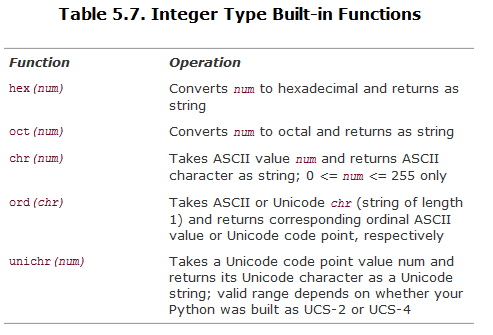
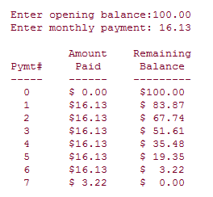

# 本章大纲
介绍Python支持的多种数字类型，包括：整型、长整型、布尔型、双精度浮点型、十进制浮点型和复数。介绍和数字相关的运算符和函数。

# 知识点
## 5.1 布尔型
从Python2.3开始支持bool，取值范围：True、False

## 5.2 标准整型
在32位机器上，标准整数类型的取值范围：-2的31次方 ~ 2的31次方-1

- Python标准整数类型等价于C语言的（有符号）长整型。
- 八进制整数以数字 “0” 开头，十六进制整数以 “0x” 或 “0X” 开头

## 5.3 长整型
- Python的长整数类型能表达的数值，仅与机器支持的(虚拟)内存大小有关。
- 在一个整数值后面加个大写L，表示是长整数。
- 必要时整型会自动转换为长整型。

## 5.4 双精度浮点数
- 每个浮点数占8个字节
- 类似C语言中的double类型
- 浮点数值通常都有一个小数点和一个可选的后缀e，eg: `9.384e-23`

## 5.5 复数
- Python1.4开始支持复数
- 虚数的表示： real+imagj，eg: `6.23+1.5j`

**复数属性：**

- num.real：复数的实部
- num.imag：复数的虚部
- num.conjugate()：返回该复数的共轭复数

## 5.6 数值类型转换
不同数据类型之间在运算之前，Python内部会将两个操作数转换为同一数据类型（强制转换）。

**不同数据类型转换基本原则**：整数转换为浮点数，非复数转换为复数。

数值类型强制转换的流程：



使用内建函数`coerce()`，对某种数据类型进行特殊类型转换。

## 5.7 运算符
- / ：除法运算，如果两个数都是整数则地板除，否则执行真正的除法（未来版本Python中除法运算的标准行为：不管操作数是整数还是浮点数，除法运算总是返回真实的商。现阶段通过执行 `from __future__ import division` 指令可实现真正的除法）
- //：地板除（向下取整）
- % ：取余，对于浮点数结果为：`x - (math.floor(x/y) * y)`
- **：幂运算，操作符比其左侧操作数的一元操作符优先级高，比右侧操作数的一元操作符的优先级低（右边的是老大）
 - `-3 ** 2` # 优先级高于左侧的 -
 - `4.0 ** -1.0` # 优先级低于右侧的 -
- 位运算符：取反优先级最高，左移和右移次之，与、或、异或最低；

## 5.8 数字类型函数
### 5.8.1 转换工厂函数
- `int(4.25555)` # 4
- `long(42)` # 42L
- `float(4)` # 4.0
- `complex(2.3e-10, 45.3e4)` # (2.3e-10+453000j)

### 5.8.2 功能函数
- **abs(num)**：返回给定参数的绝对值。eg：`abs(-1)` # 1
- **coerce(num1,num2)**：返回一个包含类型转换完毕的两个数值元素的元组。eg：`coerce(1.23-41j, 134L)` # ((1.23-41j), (134+0j))
- **divmod(num1,num2)**：结合除法运算和取余运算, 返回一个包含商和余数的元组。eg：`divmod(10,3)` # (3, 1)
- **pow(num1,num2,mod=1)**：指数运算，eg：`pow(2,3)` 。如果提供 mod参数，则再对mod进行取余运算
- **round(flt, ndig=0)** 接受一个浮点数flt并对其四舍五入，保存ndig位小数。 若不提供ndig参数，则默认小数点后0位

### 5.8.3 仅用于整数的函数


## 5.9 其他数字类型
### 5.9.1 布尔“数”
- 有两个永不改变的值 True 或 False。
- 布尔型是整型的子类，但是不能再被继承而生成它的子类。
- 没有`__nonzero__()`方法的对象的默认值是 True。
- 对于值为零的任何数字或空集（空列表、空元组和空字典等）在 Python 中的布尔值都 是 False。
- 在数学运算中，Boolean 值的 True 和 False 分别对应于 1 和 0。
- 以前返回整数的大部分标准库函数和内建布尔型函数现在返回布尔型。
- True 和 False 现在都不是关键字，但是在 Python 将来的版本中会是。

### 5.9.2 十进制浮点数 Decimal
```python
from decimal import Decimal
dec = Decimal('.1')
result = dec + Decimal('10.1')
```

## 5.10 数字类型相关模块
- 第三方包：Numeric(NumPy) 和 SciPy
- array：高效数值数组（字符，整数，浮点数等等） 
- math/cmath：标准C库数学运算函数。常规数学运算在match模块，复数运算在cmath模块
- operator：数字运算符的函数实现
- random：多种伪随机数生成器
 - `random.randrange(100, 110, 3)` # 103，随机返回range([start,]stop[,step])结果的一项
 - `random.uniform(1.1, 1.34)` # 1.300319482480275，返回的是二者之间的一个浮点数(不包括范围上限)
 -  `random.randint(12,23)` # 21，返回的是二者之间的一个整数(包括范围上限)
 - `random.random()` # 0.926576527700594，和uniform()类似，只不过下限恒等于 0.0，上限恒等于 1.0
 - `random.choice([1,2,4])` # 4，随机返回给定序列的一个元素

# 练习
**5-1 整形。讲讲Python普通整型和长整型的区别。**
普通整型：最大可表示2的63方-1（64位机器）
长整形：可表示的最大数只与机器的内存有关，普通整型“溢出”时Python可将其自动转为长整形

**5-2 运算符。
(a) 写一个函数，计算并返回两个数的乘积
(b) 写一段代码调用这个函数，并显示它的结果**

```pytnon
def multiply(num1, num2):
    return num1 * num2

print multiply(7, 11)
```

**5-3 标准类型运算符. 写一段脚本，输入一个测验成绩，根据下面的标准，输出他的评分成绩（A-F）。 A: 90–100 B: 80–89 C: 70–79 D: 60–69 F: < 60**
```python
def get_letter_grade(score):
    if score >= 90 :
        return 'A'
    elif score >=80 :
        return 'B'
    elif score >=70 :
        return 'C'
    elif score >= 60 :
        return 'D'
    else :
        return 'F'
```

**5-4 取余。判断给定年份是否是闰年。使用下面的公式： 一个闰年就是指它可以被 4 整除但不能被 100 整除， 或者它可以被 400 整 除。比如 1992，1996 和 2000 年是闰年，但 1967 和 1900 则不是闰年。下一个是闰年的整世 纪是 2400 年。**
```python
def is_leep_year(year):
    if year % 4 == 0:
        if year % 100 != 0 :
            return True
        elif year % 400 == 0:
            return True
        else:
            return False
    else:
        return False

print is_leep_year(1992)
print is_leep_year(2000)
print is_leep_year(1900)
print is_leep_year(1999)
```

**5-5 取余。取一个任意小于 1 美元的金额，然后计算可以换成最少多少枚硬币。硬币有 1 美分，5 美分，10 美分，25 美分四种。1 美元等于 100 美分。举例来说，0.76 美元换算结果 应该是 3 枚 25 美分， 1 枚 1 美分。类似 76 枚 1 美分，2 枚 25 美分+2 枚 10 美分+1 枚 5 美分+1 枚 1 美分这样的结果都是不符合要求的。**

思路：先取大面值的，再依次取小面值的，得到的就是最少枚硬币的组合
```python
def get_cent_count(num):
    cent_count_arr = []
    cents = [25, 10, 5, 1]

    left = num
    i = 0
    while left != 0:
        cent_count_arr.append(left // cents[i])
        left = left % cents[i]
        i += 1

    return cent_count_arr

print get_cent_count(76)
print get_cent_count(123)
print get_cent_count(88)
```

**5-6 算术。写一个计算器程序 你的代码可以接受这样的表达式，两个操作数加一个运算符： N1 运算符 N2. 其中 N1 和 N2 为整数或浮点数，运算符可以是+, -, \*, /, %, \*\* 分别表示 加法，减法， 乘法， 整数除，取余和幂运算。计算这个表达式的结果，然后显示出来。提示： 可以使用字符串方法 split(),但不可以使用内建函数 eval().**

思路：如果使用eval()的话，直接可以计算表达式的结果：`eval('3 * 4')`。此处需将数字字符串转换成数字，由于不知道数字的类型，使用Decimal进行转换比较方便。当然，一个个数字类型去判断也是可以的。
```python
import decimal

def num1_op_num2(op_str):
    arr = op_str.split()
    op = arr[1]
    num1 = decimal.Decimal(arr[0])
    num2 = decimal.Decimal(arr[2])

    if op == '+':
        return num1 + num2
    elif op == '-':
        return num1 - num2
    elif op == '*':
        return num1 * num2
    elif op == '/':
        return num1 / num2
    elif op == '%':
        return num1 % num2
    elif op == '**':
        return num1 ** num2
    else:
        raise ValueError("op don't exist")

print num1_op_num2("3 * 4")
print num1_op_num2("11 % 7")
print num1_op_num2("5 ** 2")
```

**5-7 营业税。随意取一个商品金额，然后根据当地营业税额度计算应该交纳的营业税。**
略。

**5-8 几何。计算面积和体积：
(a) 正方形 和 立方体
(b) 圆 和 球。**
略。

**5–9. 数值形式 回答下面关于数值格式的问题：**
**(a) 为什么下面的例子里 17+32 等于 49， 而 017+32 等于 47， 017+032 等于 41？**
Because：数字以0开头表示8进制

**（b）为什么下面这个表达式我们得到的结果是 134L 而不是 1342 ？**
Because：数字以l(L，不是1)结尾表示长整形

**5-10 转换。写一对函数来进行华氏度到摄氏度的转换。转换公式为 C = (F - 32) * (5 / 9) 应该在这个练习中使用真正的除法， 否则你会得到不正确的结果。**
```python
from __future__ import division

def tran_F_to_C(F):
    C = (F - 32) * (5 / 9)
    return round(C, 2) # 取小数点后两位

print tran_F_to_C(42)
```

**5-11 取余。 **
(a) 使用循环和算术运算，求出 0－20 之间的所有偶数 
(b) 同上，不过这次输出所有的奇数 
(c) 综合 (a) 和 (b)， 请问辨别奇数和偶数的最简单的方法是什么？ 
(d) 使用(c)的成果，写一个函数，检测一个整数能否被另一个整数整除。 先要求用户输 入两个数，然后你的函数判断两者是否有整除关系，根据判断结果分别返回 True 和 False;

*略。*

**5-12 系统限制。写一段脚本确认一下你的 Python 所能处理的整数，长整数，浮点数和复数的范围。**
```python
import sys

print sys.maxint
print -sys.maxint-1
print sys.float_info
print sys.long_info
```
result:
```
2147483647
-2147483648
sys.float_info(max=1.7976931348623157e+308, max_exp=1024, max_10_exp=308, min=2.2250738585072014e-308, min_exp=-1021, min_10_exp=-307, dig=15, mant_dig=53, epsilon=2.220446049250313e-16, radix=2, rounds=1)
sys.long_info(bits_per_digit=30, sizeof_digit=4)
```

**5-13 转换。写一个函数把由小时和分钟表示的时间转换为只用分钟表示的时间。**
略。

**5-14 银行利息。写一个函数，以定期存款利率为参数， 假定该账户每日计算复利，请计算并返回年回报率。**
```python
def compound_interest(rate):
    return (1+rate) ** 364

print compound_interest(0.0005)
```

**5–15 最大公约数和最小公倍数。请计算两个整数的最大公约数和最小公倍数。**
```python
def gcd(num1, num2):
    while num2 > 0:
        tmp = num1 % num2
        num1 = num2
        num2 = tmp
    return num1

def lcm(num1, num2):
    return num1 * num2 / gcd(num1, num2)

print gcd(24, 18)
print lcm(24,18)
```

**5-16 家庭财务。给定一个初始金额和月开销数， 使用循环，确定剩下的金额和当月的支出数， 包括最后的支出数。 Payment() 函数会用到初始金额和月额度， 输出结果应该类似下 面的格式（例子中的数字仅用于演示）：**



```python
def pay():
    balance = float(raw_input('Enter opening balance: '))
    balance = round(balance, 2)
    payment = float(raw_input('Enter monthly payment: '))
    payment = round(payment, 2)

    print '     \tAmount\tRemaining'
    print 'Pymt#\tPaid\tBalance'
    print '------\t------\t------'

    print '0\t$0.00\t$%s' % balance
    i = 1
    while balance > payment:
        balance -= payment
        balance = round(balance, 2)
        print '%d\t$%s\t$%s' % (i, payment, balance)
    print '%d\t$%s\t$0.00' % (i, balance)

pay()
```

**5-17 随机数。熟读随机数模块然后解下面的题： 生成一个有 N 个元素的由随机数 n 组成的列表， 其中 N 和 n 的取值范围分别为： (1 < N <= 100), (0 <= n <= 2^31 -1)。然后再随机从这个列表中取 N (1 <= N <= 100)个随机数 出来， 对它们排序，然后显示这个子集。**
```python
import random

def rand_sort_num():
    res = []
    N = random.randint(1, 100)
    while N > 0:
        n = random.randint(0, 2**31-1)
        res.append(n)
        N -= 1

    res.sort()
    return res

print rand_sort_num()
```