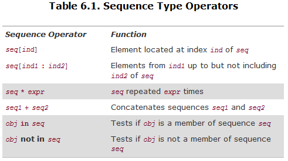

# 本章大纲
详细介绍字符串、列表、元组的相关操作，常用的序列内建函数，Unicode和编码解码原理，深拷贝和浅拷贝的原理。

# 知识点
## 6.1 序列
### 6.1.1 标准类型操作符
标准类型操作符一般都能适用于所有的序列类型。

### 6.1.2 序列类型操作符



**高效合并：**

- 字符串：`''.join(strList)`
- 列表：`list1.extend(list2)`

实战：遍历一个字符串，每次都把位于最后的一个字符砍掉
```python
for i in [None] + range(-1, -len(strList), -1):
     print strList[:i]
```

### 6.1.3 序列的类型转换工厂函数

- `list(iter)`
- `tuple(iter)`
- `str(obj)`
- `unicode(obj)`

## 6.2 字符串

### 6.2.1 字符串的操作符

判断一个字符串是否包含另一个字符串: `find()`、`index()`、`rfind()`、`rindex()`

**string模块预定义的字符串：**

- `string.ascii_uppercase`
- `string.ascii_lowercase`
- `string.letters`
- `string.digits`

**出于性能方面的考虑， 尽量不适用string模块：**Python必须为每一个参加连接操作的字符串分配新的内存，包括新产生的字符串。最好使用`join()`进行字符串的连接！

**注意：**把重复操作作为参数放到循环里面进行是非常低效的。
e.g.：`while i < len(myString):`
可优化为：`length = len(myString)`

**编译时字符串连接：**一个字符串字分成几个部分写（避免加反斜杠），作为函数参数时可换行写并加上注释。
e.g.：`foo = "Hello" 'world!'`

### 6.2.2 字符串的格式化
#### 6.2.2.1 格式化操作符( % )
1、元组形式：

- `"%x" % 108 ` \# '6c'
- `"%#X" % 108 ` \# '0X6C'
- `'%.2f' % 1234.567890` \# '1234.57'
- `'%E' % 1234.567890` \# '1.234568E+03'
- `'%g' % 1234.567890234` \# '1234.57'
- `'dec: %d/oct: %#o/hex: %#X' % (123, 123, 123)` \# 'dec: 123/oct: 0173/hex: 0X7B'
- `"MM/DD/YY = %02d/%02d/%d" % (2, 15, 67)` \# 'MM/DD/YY = 02/15/67'

2、字典形式：

`'There are %(howmany)d %(lang)s Quotation Symbols' % {'lang': 'Python', 'howmany': 3}`
\# 'There are 3 Python Quotation Symbols'

#### 6.2.2.2 字符串模板
```python
#!/usr/bin/env python
import string from Tamplate

s = Template('There are ${howmany} ${lang} Quotation Symbols')

# There are 3 Python Quotation Symbols
print s.substitute(lang='Python', howmany=3) 

# There are ${howmany} Python Quotation Symbols
print s.safe_substitute(lang='Python')
```

#### 6.2.2.3 原始字符串操作符( r/R )
e.g.：`m = re.search(r'\\[rtfvn]', r'Hello World!\n')`

#### 6.2.2.4 Unicode字符串操作符( u/U )
- `u'a\u1234\n'` \# U+0061 U+1234 U+0012
- 原始Unicode字符串：`ur'Hello\nWorld!'`

### 6.2.3 字符串的内建函数
初始：`quest = 'what is your favorite color?'`

- `quest.center(40)` # 居中后剩下的字符用空格填充
- `quest.count('or')` # 2
- `quest.find('or', 22)` # 25
- `quest.index('or', 10)` # 16, 同find(), 但如果'or'不存在会报错

## 6.3 常用内建函数
- `cmp('abc', 'lmn')` # -11
- `min('ab42cd')` # '2'
- `for i, t in enumerate('foo')`
- `zip('foa', 'obr')` # [('f', 'o'), ('o', 'b'), ('a', 'r')]
- `isinstance(u'\0xAB', str)` # False
- `chr(65) `# 'A'
- `ord('a')` # 97
- `unichr(12345)` # u'\u3039'

## 6.4 Unicode
1. ASCII码用8位二进制（一个字节）把字符转换成数字的方式存储在计算机内。
2. Unicode 使用一个或多个字节来表示一个字符的方法突破了 ASCII 的限制, 可以表示超过 90,000 个字符。
3. 在任何需要跟 Unicode 兼容的代码里都不要string模块，Python保留该模块仅仅是为了向后兼容。
4. 内建函数 `unicode()`和 `unichar()`可以看成 Unicode 版本的 `str()`和 `chr()`。
5. `unicode()` 函数可以把任何 Python 的数据类型转换成一个 Unicode 字符串,如果是对象，并且该对象定义 了`__unicode__()`方法，它还可以把该对象转换成相应的 Unicode 字符串。

**Codecs**：

- codec 是 COder/DECoder 的首字母组合，它定义了文本跟二进制值的转换方式。
- 常见的有编码格式：ASCII，ISO 8859-1/Latin-1，UTF-8，UTF-16。
- **UTF-8编码**：用一个字节来编码 ASCII 字符，用 1~4 个字节来表示其他语言的字符，CJK/East这样的东亚文字一般用3个字节来表示，少数字符用 4个字节来表示。
- UTF-16编码：容易读写，但不向后兼容ASCII，所有的字符都是用单独的一个16位字（2个字节）来存储的。
- **编码解码**：`encode()` 和 `decode()` 内建函数接受一个字符串做参数返回该字符串对应的 解码后/编码后 的字符串。

## 6.5 列表

### 6.5.1 列表解析
`[ i * 2 for i in [8, -2, 5] ]` #[16, -4, 10]
`[ i for i in range(8) if i % 2 == 0 ]` #[0, 2, 4, 6]

### 6.5.2 列表的cmp流程

1. 对两个列表的元素进行比较.
2. 如果比较的元素是同类型的,则比较其值,返回结果.
3. 如果两个元素不是同一种类型,则检查它们是否是数字.
    a. 如果是数字,执行必要的数字强制类型转换,然后比较.
    b. 如果有一方的元素是数字,则另一方的元素比较"大"(数字是"最小的")
    c. 否则,通过类型名字的字母顺序进行比较
4. 如果有一个列表首先到达末尾,则另一个长一点的列表比较"大".
5. 如果用尽了两个列表的元素,而且所有元素都是相等的,那么返回0.

### 6.5.3 使用内建函数操作列表
- `for t in reversed(s): `# `reversed(s)`得到的是一个listreverseiterator object，而`s.reverse()`无返回值
- `sorted(s)` # 返回排序后的一个新列表，而`s.sort()`无返回值
- `for i, album in enumerate(albums):` # 遍历时有序号和元素
- `for i, j in zip(list1, list2):` # 同时遍历两个列表
- `reduce(operator.add, numList)` # 对numList的所有元素进行add操作
- `sum(numList, 7)` # 计算numList的总和，再加上7

小技巧-同时输出三个对象的ID：`[id(x) for x in aList, aTuple, anotherList]`

### 6.5.4 列表的方法
**获取元素在列表中的位置**
使用`index()`获取元素位置时，若元素不存在会抛ValueError，解决方案是先用` in `判断一下，如：
```python
for eachMediaType in (45, '8-track tape', 'cassette'):
   if eachMediaType in music_media:
       print music_media.index(eachMediaType)
```

**`extend()`的妙用(参数支持任何可迭代对象)：**
```python
>>> motd = []
>>> motd.append('MSG OF THE DAY')
>>> f = open('/lines.txt', 'r')
>>> motd.extend(f)
>>> f.close()
>>> motd
['MSG OF THE DAY', 'line1\n', 'line2\n']
```
### 6.5.5 用列表实现其他数据结构
- 堆栈：stack是一种后进先出(LIFO)的数据类型
- 队列：queue是一种先进先出(FIFO)的数据类型


## 6.6 元组
所有的多对象的，逗号分隔的，没有明确用符号定义的，等等这些集合默认的类型都是元组。

**元组除了不可变操作外，其他操作大多和列表相似。**

**实用例子：**

- “移除”元组的元素：`aTuple = aTuple[0] , aTuple[-1]` # 通过组合一个新的元组来实现
- 创建单一元素的元组：`('xyz',)` # 圆括号被重载了，它也被用作分组操作符。


**元组不可变性的好处：**

- 当把元组数据传给一个API时，可以确保数据不会被修改。同样地，如果操作从一个函数返回的元组，可以通过内建list()函数把它转换成一个列表。
- 不可变对象的值是不可改变的，它们通过 hash 算法得到的值总是一个值，这是作为字典键值的一个必备条件。

## 6.7 浅拷贝和深拷贝
## 6.7.1 浅拷贝

**浅拷贝：**新创建了一个类型跟原对象一样的对象，且内容是原来对象元素的引用。即拷贝的对象本身是新的，但是它的内容不是。序列类型对象的默认类型拷贝就是浅拷贝。

**浅拷贝的方式有：**

1. 完全切片操作[:]
2. 利用工厂函数`list()`、`dict()`等
3. 使用 copy 模块的 `copy()`

## 6.7.2 深拷贝
**深拷贝：**新创建了一个类型跟原对象一样的对象，内容和原来对象元素的相同但不是同样的对象元素，更改原对象的元素不会影响到深拷贝对象，反之亦然。深拷贝可以通过copy模块的`deepcopy()`实现，或手动遍历一个个copy。

**深拷贝的约束条件（具有可变性的容器类型才能深拷贝）：**

- 非容器类型(比如数字、字符串和元组等)没有被拷贝一说，浅拷贝是用完全切片操作来完成的。
- 如果元组变量只包含原子类型对象，对它的深拷贝将不会进行。

# 练习
**6–1. 字符串.string 模块中是否有一种字符串方法或者函数可以帮我鉴定一下一个字符串是否是另一个大字符串的一部分?**

`string.find()` & `string.index()`

**6–2. 字符串标识符.修改例 6-1 的 idcheck.py 脚本,使之可以检测长度为一的标识符,并且可以识别 Python 关键字,对后一个要求,你可以使用 keyword 模块(特别是 keyword.kelist)来帮你.**

```python
#!/usr/bin/env python
import string
import keyword

alphas = string.letters + '_'
nums = string.digits

print 'Welcome to the Identifier Checker v1.0'
print 'Testees must be at least 2 chars long.'
myInput = raw_input('Identifier to test? ')

if myInput[0] not in alphas:
    print 'invalid: first symbol must be alphabetic'
else:
    if len(myInput) == 0:
        print "okay as an identifier"
    else:
        for otherChar in myInput[1:]:
            if otherChar not in alphas + nums:
                print 'invalid: remaining symbols must be alphanumeric'
                break
        if keyword.iskeyword(myInput):
            print "invalid: input string is a keyword"
        else:
            print "okay as an identifier"
```

**6–3. 排序**
(a) 输入一串数字,从大到小排列之.
(b) 跟a一样,不过要用字典序从大到小排列之.

```python
#!/usr/bin/env python
import string

def des_sort_numstr_by_decimal(numstr):
    numlist = numstr.split(',')
    for i in range(0, len(numlist)):
        numlist[i] = int(numlist[i])

    numlist.sort()
    numlist.reverse()
    return numlist
def des_sort_numstr_by_dictionary(numstr):
    numlist = numstr.split(',')
    numlist.sort()
    numlist.reverse()
    return numlist

if __name__ == '__main__':
    numstr = raw_input('input some number: ')
    print "before sort: " + numstr
    print "sort by decimal: " + str(des_sort_numstr_by_decimal(numstr))
    print "sort by dictionary: " + str(des_sort_numstr_by_dictionary(numstr))
```

**6–4. 算术. 更新上一章里面你的得分测试练习方案,把测试得分放到一个列表中去.你的代码应该可以计算出一个平均分,见练习 2-9 和练习 5-3.**
```python
#!/usr/bin/env python
def cal_average_score(score_list):
    sum = 0
    for score in score_list:
        sum += score
    return float(sum) / len(score_list)

def get_letter_grade(score_list):
    average_score = cal_average_score(score_list)
    if average_score >= 90 :
        return 'A'
    elif average_score >=80 :
        return 'B'
    elif average_score >=70 :
        return 'C'
    elif average_score >= 60 :
        return 'D'
    else :
        return 'F'

print get_letter_grade([79,23,99,82,54,43])
```

**6–5. 字符串**
(a)更新你在练习 2-7 里面的方案,使之可以每次向前向后都显示一个字符串的一个字符.
(b)通过扫描来判断两个字符串是否匹配(不能使用比较操作符或者 cmp()内建函数)。附加题：在你的方案里加入大小写区分.
(c)判断一个字符串是否重现(后面跟前面的一致).附加题：在处理除了严格的回文之外,加入对 例如控制符号和空格的支持。
(d)接受一个字符,在其后面加一个反向的拷贝,构成一个回文字符串.
略。

**6–6. 字符串.创建一个 string.strip()的替代函数:接受一个字符串,去掉它前面和后面的空格(如果使用 string.*strip()函数那本练习就没有意义了)**
```python
#!/usr/bin/env python
import string

def my_string_strip(_str):
    if len(_str) <= 0:
        return _str

    # left strip
    while _str[0] == ' ':
        _str = _str[1:len(_str)]
    # right strip
    while _str[len(_str)-1] == ' ':
        _str = _str[0:len(_str)-1]

    return _str

print my_string_strip('   asdf asdf   ')
```

**6–7. 调试.看一下在例 6.5 中给出的代码(buggy.py) **
(a)研究这段代码并描述这段代码想做什么.在所有的(#)处都要填写你的注释. 
(b)这个程序有一个很大的问题,比如输入 6,12,20,30,等它会死掉,实际上它不能处理任何的偶数,找出原因. 
(c)修正(b)中提出的问题. 
(a)输入一个数字n，生成一个从1到n的数字列表，去掉列表中可以被n整除的数字。
(b)在del fac_list[i]后，列表的长度减少了1
(c)fix bug:
```python
num_str = raw_input('Enter a number ')
num_num = int(num_str)
fac_list = range(1, num_num+1)
print "BEFORE:", `fac_list`

i = 0
while i < len(fac_list):
    if num_num % fac_list[i] == 0:
        del fac_list[i]
        i -= 1
    i = i + 1

print "AFTER:", `fac_list`
```

**6–8. 列表.给出一个整数值,返回代表该值的英文，比如输入 89 返回"eight-nine"。附加题： 能够返回符合英文语法规则的形式，比如输入“89”返回“eighty-nine”。本练习中的值限定在 0 到 1,000。**
```python
#!usrbinenv python
#!usrbinenv python
class numtool():
    zero_to_nine = ['zero','one','two','three','four','five','six','seven','eight','nine']
    ten_to_nineteen = ['ten','eleven','twelve','thirdteen','fourteen','fifteen','sixteen','eighteen','nineteen']
    twenty_to_ninety = ['twenty','thirty','forty','fifty','sixty','seventy','eighty','ninety']
    hundred = 'hundred'
    _and = ' and '
    space = ' '

    def num2en_0_to_100(self, num):
        if not 0 <= num < 100:
            return

        elif num < 10:
            return self.zero_to_nine[num]
        elif num < 20:
            return self.ten_to_nineteen[num-10]
        elif num < 100:
            if num % 10 == 0:
                return self.twenty_to_ninety[num/10 - 2]
            else:
                left = self.twenty_to_ninety[num/10 - 2]
                right = self.zero_to_nine[num % 10]
                return left + self.space + right

    def num2en(self, num):
        if not 0 <= num <= 1000:
            return

        if num < 100:
            return self.num2en_0_to_100(num)
        else:
            if num == 1000:
                return 'one thousand'
            elif num % 100 == 0:
                return self.zero_to_nine[num / 100] + self.space + self.hundred
            else:
                left = self.zero_to_nine[num / 100]
                right = self.num2en_0_to_100(num % 100)
                return left + self.space + self.hundred + self._and + right

tool = numtool()
while True:
    num = raw_input('input a number: ')
    print tool.num2en(int(num))
```

**6–9. 转换.为练习 5-13 写一个姊妹函数, 接受分钟数, 返回小时数和分钟数. 总时间不变,并且要求小时数尽可能大. **

*略。*

**6–10.字符串.写一个函数,返回一个跟输入字符串相似的字符串,要求字符串的大小写反转. 比如,输入"Mr.Ed",应该返回"mR.eD"作为输出.**
```python
def reverse_up_low(ss):
    result = []
    for s in ss:
        if 'a' <= s <= 'z':
            result.append(s.upper())
        elif 'A' <= s <= 'Z':
            result.append(s.lower())
        else:
            result.append(s)
    return ''.join(result)

print reverse_up_low('Mr.Ed')
```

**6–11.转换
(a)创建一个从整数到 IP 地址的转换程序,如下格式: `WWW.XXX.YYY.ZZZ`
(b)更新你的程序,使之可以逆转换.**

*略。*

**6–12.字符串 **
(a)创建一个名字为 findchr()的函数,函数声明如下: def findchr(string, char) findchr()要在字符串 string 中查找字符 char,找到就返回该值的索引,否则返回-1.不能用 string.*find()或者 string.*index()函数和方法 
(b)创建另一个叫 rfindchr()的函数,查找字符 char 最后一次出现的位置.它跟 findchr()工作类似,不过它是从字符串的最后开始向前查找的. 
(c)创建第三个函数,名字叫 subchr(),声明如下: def subchr(string, origchar, newchar) subchr()跟 findchr()类似,不同的是,如果找到匹配的字符就用新的字符替换原先字符.返回修改后的字符串.

*略。*

**6–13.字符串.string 模块包含三个函数,atoi(),atol(),和 atof(),它们分别负责把字符串转换成整数,长整型,和浮点型数字.从 Python1.5 起,Python 的内建函数 int(),long(),float()也可以做相同的事了, complex()函数可以把字符串转换成复数.(然而 1,5 之前,这些转换函数只能工作于数字之上).string 模块中并没有实现一个 atoc()函数,那么你来实现一个atoc(),接受单个字符串做参数输入,一个表示复数的字符串,例如,'-1.23e+4-5.67j',返回相应的复数对象.你不能用 eval()函数,但可以使用 complex()函数,而且你只能在如下的限制之下使用 complex():complex(real,imag)**

*略。*

**6–14.随机数.设计一个"石头,剪子,布"游戏,有时又叫"Rochambeau",你小时候可能玩过,下面是规则.你和你的对手,在同一时间做出特定的手势,必须是下面一种手势:石头,剪子,布.胜利者从下面的规则中产生,这个规则本身是个悖论.**
(a)布包石头. (b)石头砸剪子 (c)剪子剪破布.
在你的计算机版本中,用户输入她/他的选项,计算机找一个随机选项,然后由你的程序来决定一个胜利者或者平手.注意:最好的算法是尽量少的使用 if 语句.

```python
#!usrbinenv python
import random

def rps(arg1, arg2):
    # ['rock','paper','scissors']
    rule = {'rp':-1,'rs':1,'rr':0, 'pr':1,'ps':-1,'pp':0, 'sr':-1,'sp':1,'ss':0}
    return rule[arg1[0] + arg2[0]]

user_value = raw_input('your choose: [rock|paper|scissors] ')
app_value = ['rock','paper','scissors'][random.randint(0,2)]
print 'app chooses ' + app_value

res = rps(user_value, app_value)
if res == 1:
    print 'user win'
elif res == 0:
    print 'equals'
else:
    print 'application win'
```

**6–15.转换 (a)给出两个可识别格式的日期,比如 MM/DD/YY 或者 DD/MM/YY 格式,计算出两个日期间的天数. (b)给出一个人的生日,计算从此人出生到现在的天数,包括所有的闰月. (c)还是上面的例子,计算出到此人下次过生日还有多少天.**

*略。*

**6–16.矩阵.处理矩阵 M 和 N 的加和乘操作.**

*略。*

**6–17.方法.实现一个叫 myPop()的函数,功能类似于列表的 pop()方法,用一个列表作为输入, 移除列表的最新一个元素,并返回它.**

*略。*

**6–18. zip() 内建函数 在 6.13.2 节里面关于 zip()函数的例子中,zip(fn,ln)返回的是什么?**
`[('ian', 'bairnson'), ('stuart', 'elliott'), ('david', 'paton')]`

**6–19.多列输出.有任意项的序列或者其他容器,把它们等距离分列显示.由调用者提供数据和输出格式.例如,如果你传入 100 个项并定义 3 列输出,按照需要的模式显示这些数据.这种情况下,应该是两列显示 33 个项,最后一列显示 34 个.你可以让用户来选择水平排序或者垂直排序.**

*略。*
