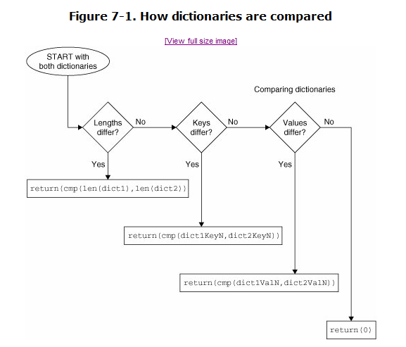

# 本章大纲
介绍由多个键值对组成的字典和元素不可重复的集合。

# 知识点
## 7.1 字典
字典中的key必须是可哈希的（选择可哈希的key是因为它们的值不能改变），数字和字符串可以作为字典中的key， 但是列表和其他字典不行。（使用`hash()`计算可哈希对象的hash值）

**创建字典的三种方法：**

- `dict1 = dict(x=1, y=2)` # {'y': 2, 'x': 1}
- `dict1 = dict((['x',1],['y',2]))` # {'y': 2, 'x': 1}
- `dict1 = {}.fromkeys(('x','y'), -1)` # {'y': -1, 'x': -1}

**字典的常用操作：**

- `dict2.keys()`
- `for key in dict2:` # 默认遍历的是keys
- `if key1 in dict1:` # dict1[key1]取值前先判断key是否存在，不存在会会抛异常
- `print 'host %(name)s is running on port %(port)d' %dict2`
- `dict2.pop('name')`


## 7.2 字典的比较算法

1. 比较字典长度：key越多，dict越大
2. 比较key：key比较的顺序和 keys()方法返回key的顺序相同。
3. 比较value：若key相同，则比较对应的value
4. 长度、keys、values都相等，完全匹配返回0



## 7.3 字典的浅复制

- <code>dict2 = dict(**dict1)</code>
- `dict2 = dict1.copy()`

## 7.4 字典的内建方法

- `dict1.update(dict2)` # 将字典 dict2 的键-值对添加到字典 dict1
- `sorted(dict1)` # 返回排序后的字典的keys列表
- `dict1.get('x',123)` # 获取key为x的value，如果key不存在返回默认值123（不是抛异常），如果存在则返回value
- `dict1.setdefault('b',444)` # 若字典不存在则添加一对新的key-value，否则覆盖key的旧value为新的value

## 7.5 集合类型
集合的**元素不可重复**，分为两种类型：可变集合（可更新元素）和不可变集合。

### 7.5.1 可变集合
- `set('aaabcd')` # `set(['a', 'c', 'b', 'd'])`
- `a.add('z')`
- `a.update('xyz')`
- `a.remove('z')`
- `a -= set('abc')`

### 7.5.2 不可变集合
`frozenset('hijk')` # `frozenset(['i', 'h', 'k', 'j'])`

## 7.6 集合类型操作符
**注意：** 集合的操作结果类型与左操作数的类型相同。

## 7.6.1 适用于两种集合类型的操作符
- 子集/超集：“小于”符号( <, <= ) 用来判断子集，“大于”符号( >, >= )用来判断超集。
- 并集( | )：`a | b` # **a+b是错误的**，加号不是集合类型的运算符！
- 交集( & )：`a & b` # 相当于`a.intersection(b)`
- 差集( – )：`a - b` # 相当于`a.difference(b)`
- 对称差分( ^ )：`a ^ b` # 异或，相当于`(a-b)|(b-a)`或`s.symmetric_difference(t)`

## 7.6.2 只适用于可变集合类型的操作符

- 交集更新( &= )：`s &= set('pypi')` # 相当于`s.intersection_update(t)`
- 差集更新( –= )：`s -= set('pypi')` # 相当于`s.difference_update(t)`
- 对称差分更新( ^= )：`s ^= set('pypi')` # 相当于`s.symmetric_difference_update(t)`

## 7.7 集合的内建方法

- `s.issubset(t)` 如果 s 是 t 的子集，则返回 True,否则返回 False
- `s.issuperset(t)` 如果 s 是 t 的超集，则返回 True,否则返回 False
- **`s.remove(obj)`** 从集合 s 中删除对象 obj；如果 obj 不是集合 s 中的元素(obj not in s)，将引发 KeyError 错误
- **`s.discard(obj)`** 如果 obj 是集合 s 中的元素，从集合 s 中删除对象 obj；
- `s.clear()` 删除集合 s 中的所有元素

# 练习
**7–1. 字典方法。哪个字典方法可以用来把两个字典合并到一起？**
`dict1.update(dict2)`

**7–2. 字典的键。我们知道字典的值可以是任意的 Python 对象，那字典的键又如何呢？请试着将除数字和字符串以外的其他不同类型的对象作为字典的键，看一看，哪些类型可以，哪些不行？ 对那些不能作字典的键的对象类型，你认为是什么原因呢？**

`frozenset()`可以作为字典的键。
那些不能作字典的键的对象类型，是因为其值不可hash.

**7–3. 字典和列表的方法。
(a) 创建一个字典，并把这个字典中的键按照字母顺序显示出来。
(b) 现在根据已按照字母顺序排序好的键，显示出这个字典中的键和值。
(c)同(b),但这次是根据已按照字母顺序排序好的字典的值，显示出这个字典中的键和值。**

思路：遍历keys或values，用内建函数`sorted()`排好序，再根据key/value取对应的value/key。

**7-4. 建立字典。给定两个长度相同的列表，比如说，列表[1, 2, 3,...]和['abc', 'def', 'ghi',...],用这两个列表里的所有数据组成一个字典，像这样： {1:'abc', 2: 'def', 3: 'ghi',...}**
```
>>> dict1 = [1,2,3]
>>> dict2 = ['abc','def','ghi']
>>> zips = zip(dict1, dict2)
>>> zips
[(1, 'abc'), (2, 'def'), (3, 'ghi')]
>>> dict(zips)
{1: 'abc', 2: 'def', 3: 'ghi'}
```

**7-7. 颠倒字典中的键和值。用一个字典做输入，输出另一个字典，用前者的键做值，前者的值做键。**
参考7-4，调换`zip()`的参数位置。

**7-8. 人力资源。创建一个简单的雇员姓名和编号的程序。让用户输入一组雇员姓名和编号。 你的程序可以提供按照姓名排序输出的功能，雇员姓名显示在前面，后面是对应的雇员编号。附加 题：添加一项功能，按照雇员编号的顺序输出数据。**
参考7-3。

**7–11. 定义。什么组成字典中合法的键? 举例说明字典中合法的键和非法的键。**
可以计算出哈希值的数据类型组成字典的合法的键，如：数字、字符串、不可变集合。其他数据类型为法的键。

**7-12. 定义。**
**(a)在数学上，什么是集合?**
由一个或多个元素所构成的叫做集合。

**(b)在 Python 中，关于集合类型的定义是什么？**
由不同元素组成的组合。

**7–15. 编写计算器。 编写一个程序允许用户选择两个集合:A 和 B, 及运算操作符。例如，in, not in, &, |, ^, <, <=, >, >=, ==, !=, 等. (你自己定义集合的输入语法，它们并不一定要像 Java 示例中那样用方括 号括住。)解析输入的字符串，按照用户选择的运算进行操作。你写的程序代码应该比 Java 版本的 该程序更简洁。**
```python
#!/usr/bin/env python

def issubset(set1, set2):
    return set1.issubset(set2)
def issuperset(set1, set2):
    return set1.issuperset(set2)
def union(set1, set2):
    return set1 | set2
def intersection(set1, set2):
    return set1 & set2
def difference(set1, set2):
    return set1 - set2
def symmetric_difference(set1, set2):
    return set1 ^ set2

set1 = set(['aa',123,'bb'])
set2 = set(['aa',456])

# ^, <, <=, >, >=, ==, !=
ops = {'sub':issubset, 'super':issuperset, '|':union, '&':intersection, '-':difference, '^':symmetric_difference}

for op in ops:
    print op, ops[op](set1, set2)
```
